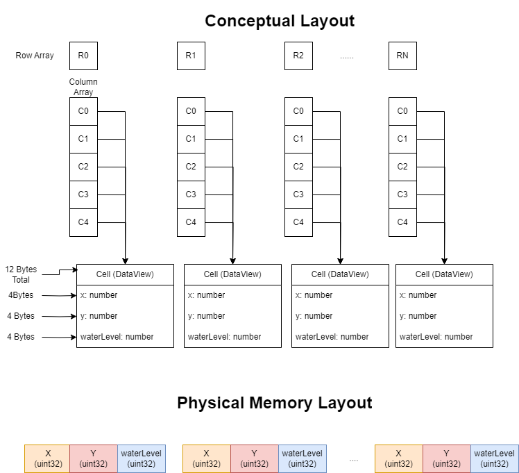

# Devlog Entry 01 - 11/18/2023

## Introducing the Team

**Kayla Garcia** - Design Lead

Reponsibilities:

- Establish creative direction of the project.
- Create relevant art assets.
- Lead discussions on design and feel of the project.

**Harrison Le** - Tools Lead

Responsibilities:

- Identify tools needed to configure the project.
- Research new tools that may be needed to meet new challenges.
- Manage tools for code style consistency and project deploymnet.

**Christian Perez** - Testing Lead

Responsibilities:

- Write and test neccessary code.
- Produce testing guidlines and maintain a consistent working version of the project.
- Identify and fix bugs that arise within the program.

**Autumn Plaxco** - Engine Lead

Responsibilities:

- Maintain the game engine of choice and research new engines to meet challenges.
- Establish standards for code organization and management.
- Produce code examples and propose software design.

**Dongling Yang (Ada)** - Art Lead

Responsibilities:

- Create majority of art assets needed for the project.
- Create necessray data files for implementing animations.
- Outline game mechanics as related to project's art style and visual format.

## Tools and Materials

In developing our project, we have decided to utilize the JavaScript library/framework, Phaser 3, as our primary game engine. The platform we intend for our game to be run in is
web browsers, as the Phaser engine is used primarily to create HTML5 games. The main reason we decided to implement our project using Phaser is because everyone on our team is already
familiar with it, and have previously utilized it to create small web-based games. The fact that we are all already experienced with using Phaser will enable up to delve more quickly
into implementing the mechanics of our game, and test out individual components of it, rather than spending the majority of our time trying to learn new tools that we may have never
interacted with before. Further into our game's development, if we find that we may want to implement new mechanics or features into our game, it will be easy for us to integrate
any new JavaScript libraries that might benefit our project by using Node.js.

Rather than using JavaScript, which is what the Phaser library was originally created to be utilized alongside, we will primarily be utilizing TypeScript. We've decided to utilize
TypeScript over traditional Javascript because we have found that, for a multitude of reasons, it helps to make collaboration between team members a bit easier. Because TypeScript implements
a more explicit type system, this will make it much easier for us to communicate the purpose of different sections of our code, so that we can better understand what each variable for each class
and scenes within our game ought to be used for. TypeScript also allows for the usage of interfaces, which will be particularly useful for us to utilize within this particular project,
as it will let us create different types of game objects with similar game mechanics and variables. Overall, we have found it to be a much more organized and manageable programming language as
compared to vanilla JavaScript. As we are using TypeScript, this also means that we will likely use the JSON for data storage, as it is a very standard file format that works well with the
programming language, as well as HTML and CSS where applicable when designing the interface and look of the playable web page for our game.

One of the primary tools we will be utilizing in the development of our game is the code editor, VS Code. Again, we are familiar with utilizing the interface of VS Code from previous projects
and assignments that we have done, so we are confident in our abilities to continue utilizing VS Code for this project. This particular code editor has a multitude of features, including
terminal and git integration, as well as a multitude of extensions which makes it suitable for our development environment. In addition to this we will also use Vite as our primary bundler,
as we have used it before and it is a suitable means for us to run and test our code as we develop it, especially when it comes to the TypeScript language. For the sake of maintaining
consistent formatting and styling guidelines that we will each follow when writing code, we will also use ESLint and Prettier, as ESLint will allow us to create standard rules for us to follow
when programming, and Prettier will maintain a consistent code format. These two tools will be helpful in maintaining consistency and readability between each of our programmers. Besides these
programming tools, there are also several art-based tools that we will utilize for the visual aspects of our game. Our game will be in pixel style since it’s the best option when we are only
allowed a limited time frame. Additionally, based on the previous experience, we have noticed that using Phaser and JSON can help us to easily make cool interactions and animation effects.
So, we will be using Adobe Suite to make most of the image assets, and then to use JSON, and some Phaser tools, to apply these animations and interactions.

## Outlook

One unique and interesting mechanic that we hope to implement within our game - that still maintains the requirements of the assignments, but seeks to go a bit beyond them - is a sort of
upgrade system, where the player has the ability to either buy or create upgrades (ex: different types of fertilizer for the plants), which will help their plants grow at a much
faster rate to accomplish the necessary goals faster. If we are to do this, we might also implement a sort of buying/selling system, where the player can sell the plants that they grow,
if they so choose, and then use the money that they make in order to buy upgrades that they can use on their plants. We believe that adding this extra layer into our game will make it
a bit more interesting and strategic for how players may want to go about managing their garden, and choosing when they want to upgrade their abilities. In addition to this, we also hope to
create a game with a unique and interesting visual style using pixel-based artwork. We hope to create tiles for the grid in the game with a nice visual style and potentially even with short
animations to bring more life and visual style into our game beyond just its programmed aspects.

The hardest part of this project, we imagine, will getting the base program structured and implemented in such a way that it will be easily iterable and adjusted when new requirements are
added later on in the development cycle. Getting the basic game structured and laid out will be a big hurdle early on into creating this game, especially in regards to keeping it consistent
between each of our programmers so that we all understand each aspect and can work with and expand one another's code. It will certainly be challenging to do all of this while also trying to
make sure that the code is structured loosely enough that it will be easy for us to implement new features later on without needing to completely rework the way that the game already functions.
Given our hopes for the additional features we want to include, it will also be difficult for us to do so given the limited amount of time that we have to implement the basic structure of the game
and the nature of complications that arise when working on code between multiple different people with their own approaches to programming.

By approaching this project with the tools that we have selected, we are hoping to collaborate on creating a game that utilizes TypeScript and Phaser in a much more structured and complex way.
While we have experience with using Phaser and JavaScript together, we are hoping to learn how the process might differ when instead using TypeScript instead, and what sorts of benefits it offers over
traditional JavaScript. We are also hoping to combine the knowledge that we have previously gained by using Phaser and our newfound knowledge of more advanced programming tools and development patterns,
so to create a project in a way that expands upon our past experiences by utilizing more complex tools and structures. In addition to this, we are also hoping to gain more experience of programming collaboratively,
and to learn the best practices of managing various game factors while keeping the code readable and flexible between group members. Lastly, in a more general sense, we wish to gain a deeper understanding
of game development in a team environment.

# Devlog Entry 02 - 11/22/2023

## How We Satisfied Softwate Requirements [F0]

- [F0.a] You control a character moving on a 2D grid:

  Thus far in development, the player has control over a 2D sprite, which they can move in 4 different directions on the screen using the arrow keys. The game world is currently split up in a grid like
  pattern, where each grid cell is 30x30. The player's movement is not contained explicity to the bounds of each cell, as they can move in any way they wish with their limited 4 directional movement, as we
  wanted the player to have more direct control over their movements through the game world, the primary gardening mechanics themselves are restricted to this grid based pattern, and the player can only plant
  crops within the bounds of each grid cell. Though not required, we also have some directional walking and idle animations set up for the player, to give a bit more life to the scene rather then having a
  completely static controllable character. The controllable sprite we have now is only temporary, and we have the final spritesheet animations already set up, but we will implement this more polished version
  later on.

- [F0.b] You advance time in the turn-based simulation manually:

  Within our game, we have a "sleeping" mechanic, which allows the player to progress time forwards to the next day. In order to do this, the player can press the "S" key to progress to the next turn, which is
  when the new eather conditions for the next day are randomized, and how plants are enabled to grow over time. Rather than having a contsant update() loop to progress the game and change its state (aside from
  where the player chooses to plant crops), this mechanic serves to advance time within the game forwards in a sort of turn-based simulation whenever the player chooses to do so.

- [F0.c] You can reap (gather) or sow (plant) plants on the grid when your character is near them:

  As the player moves through the gird, the cell that they are currently standing within the bounds of is calculated and updated to reflect their current position. Based on what grid cell the player is standing
  on, if the player presses a key to "plant" one of their selection of crops (right now these are the "1", "2", and "3" keys on the keyboard), which will create a new crop within whatever grid cell they are
  within the bounds of. In order to "gather"/"harvest" these crops, if the player can press the "Space" key in order to remove a crop from the grid, if there currently exists a crop in the particular grid cell
  they are standing on. In order to store the information of which crop is placed in which grid cell, we are utilizing a map, which uses the numbered (row, collumn) grid cell as a key, and maps it to the newly
  created crop. When a player gathers a crop, its sprite will be removed from the scene and the grid cell will be set to null within the map. The crop will only count as "collected" and added to their inventory
  of crops if it was fully grown when the player harvested it.

- [F0.d] Grid cells have sun and water levels. The incoming sun and water for each cell is somehow randomly generated each turn. Sun energy cannot be stored in a cell (it is used immediately or lost)
  while water moisture can be slowly accumulated over several turns:

  For each grid cell in our game, they each have the same sun and water levels as generated each turn when the player chooses to "sleep". For this particular mechanic, when the player sleeps within the game,
  the sun level for the next day when they awaken is randomized to a new integer, while the water level is instead calculated based on a random chance of rain. If it rains when while the player sleeps and
  progresses to the next turn, there is a random chance of rain, which will set the water level to its highest for that day. As time progresses without rain, this water level will slowly decrease back down to
  its lowest value unless it rains again during that period of time. in tjis sense, the sun level is randomly selected each day, while the water level is randomly increased if a certain random event occurs and
  decrements over time as the rain water dries up.

- [F0.e] Each plant on the grid has a type (e.g. one of 3 species) and a growth level (e.g. “level 1”, “level 2”, “level 3”):

  Within our game, we have a generic crop class which describes the crops growth, and contains functions to allow it to grow each time that the player sleeps. Based on which of the crops that the player decides
  to plant a crop in a particular grid cell, which, as of now includes strawberries, potatoes, and corn as the three different types of plants, specific data, like the crop name and growth conditions are passed
  to the newly created crop, which will influence the sprites that it uses to represent itself on the grid, and also determines whether or not the crop will be able to grow based on the weather conditions of the
  current turn. When these crop type specific conditions are met, its growth level will increase from level 1 to level 6, and the crop type specific sprite used to represent that crop will change to reflect
  this growth level.

- [F0.f] Simple spatial rules govern plant growth based on sun, water, and nearby plants (growth is unlocked by satisfying conditions):

  As we have it set up now, each turn, all of the crops currently on the grid will attempt to grow and increase their growth level. However, these crops will only grow if the generated sun level and water level
  of the crop's current grid cell meets the specific crop type's needed minimum numerical water and sun levels, though, as of now, each grid cell posseses the same global value of sun and water levels, as we
  though that best fit the theme of our game. If these conditions are not satisfied, then the plant will not be able to progress its growth, and its current sprite representation and growth level will remain
  stagnant, until the next turn that both of these conditions are correctly met. Of course, these requirements are different per crop type, so this means that some crops will likely end up growing fatser than
  others and will grow at different rates, depending upon their minimum necessary sun and water levels.

- [F0.g] A play scenario is completed when some condition is satisfied (e.g. at least X plants at growth level Y or above):

  Thus far in development, we have a temporary condition that needs to be satisfied in order for the player to complete the gameplay scenario, that being, to harvest five fully grown strawberries. When a player
  harvests crops, if this crop is fully grown, the overall count of how many of that particular crop type they have harvested increases, so in order to check if the player has satified the win condition, we
  check if the current count within their inventory for the particular plant has met the needed number. When the player does satisfy these conditions, they are given a "You win!" message and prompted to restart
  the game from the begining again. This logic is temporary for now, as we will likely change the particular conditions that the player needs to satisfy, and possibly add multiple conditions or stages of
  requirements to complete a play scenario.

## Reflection

Over the course of implementing each of the F0 requirements while we have decided to stick with utilizng the Phaser framework and the TypeScript language in the creation of this gardening game, we did encounter
a few issues regarding the ways in which we had initially set up the project, and our expectations regarding the transition from using JavaScript to TypeScript in a Phaser project. As dependencies when using
TypeScript as compared to JavaScript work a bit differently, we did face a few complications with our initial expectations regarding how global variables fundtion. In past Phaser projects, when using
JavaScript, we would simply define global variables in the main.js file, and those could be changed and accessed by any scene within the game, but global variables work much differently in TypeScript. Which impacted how we approached defining and altering variables used by different Phaser scenes and prefabs. In addition to this, we did also have to become more accustumed to the ways in which Phaser objects need
to be defined in TypeScript, as the specific types or variables need to be more specifically defined and maintained than they do in JavaScript. However, after becoming accustomed to these differences throughout
the course of fuffilling the F0 requirements, we found this engine still suitable to continue working with.

Besides some complications with getting adjusted to our game engine of choice, we also did move around some group member roles a bit, or at least, we naturally ended up taking on some different responsibilities
than originally planned. While we had both a design lead and art lead, we had originally planned on having our art lead take on most of the reponsibilities when it came to art asset creation and implementation,
but our design lead ended up creating all of the spritesheets, both temporary and final, for our player sprite and the spritesheet for the growth progression of each of our crops. In turn, our original art lead ended up creating much of the design documentation to outline our gameplay mechanics and structures. Our engine lead also ended up accounting for some of our tools lead's responsibilities while getting the engine set up for the group to use, while also enstablishing the framework to use the tools we chose to utilize. The engine lead also helped solve some issues regarding the tools utilized, specifically in regards to how the group was utilize github to create deployments of the game. So, we did end up having some role adjustments as we started getting some work done on the project and naturally started to settle
into roles that best fit the responsibilities we each wished to be accountable for.

Lastly, we have done a bit of re-evaluating on the scope of our game. Originally, we had proposed to do a upgrade system as a sort of unique feature that we wanted to implement, while also focusing a bit on our
visual style with polished pixel art. During this stage of the project, it took quite a bit of time to get the framework of the game and its basic mechanics all implemented, more than we had originally
anticipated. Even then, there are still a few more features that we wish to fine tune in the future, including having a few more specific spatial conditions outside of the sun and water levels that will
influence how players interact with the game, and also adjusting how the sun and water level calculations work, to perhaps make the water level in particular different per cell to add a bit more variety. So in
this case, we may want to rethink the idea of having additional mechanics like the proposed upgrade system, as it might take too much time to implement when we want to focus more on polshing up our already
existing mechanics. We are however, content with the progress of our visual assests, including the player and crop spritesheets and animations, so we are planning on continuing to create more of these assets to
even further develop the art and visuals of our game.

# Devlog Entry 03 - 11/29/2023

## How We Satisfied Software Requirements [F0 - F1]

- [F0.a] You control a character moving on a 2D grid.

  Same as last week. Player controls character with continuous four directional movement on a 2D grid.

- [F0.b] You advance time in the turn-based simulation manually.

  Same as last week. Player "sleeps" to progress time forwards.

- [F0.c] You can reap (gather) or sow (plant) plants on the grid when your character is near them.

  Same as last week. Depending on the player's current grid location, they can plant a crop within that cell (if no other crop is there), and can harvest a crop within that cell (if a crop exists there).

- [F0.d] Grid cells have sun and water levels. The incoming sun and water for each cell is somehow randomly generated each turn. Sun energy cannot be stored in a cell (it is used immediately or lost) while
  water moisture can be slowly accumulated over several turns.

  Since last week, this functionaility has been altered a bit. Before, the both the sun level and the water level was global across all grid cells, but now, the water level is different per grid cell on the map.
  Now, every time the player sleeps, there is a chance of rain to occur, and, if it rains, the specific water level of each individual cell is increaed to a random high water level, and then they all indiviually
  decrease back down to the lowest water every turn that it does not rain. This means that rather than the sun levels and water levels both being global, the sun level if global, while the water level is
  individual per each cell.

- [F0.e] Each plant on the grid has a type (e.g. one of 3 species) and a growth level (e.g. “level 1”, “level 2”, “level 3”).

  Same as last week. There are three different types of crops that the player is able to plant in each grid cell, all which grow every turn to increase their level if their crop specific conditions are met.
  The only addition we made in this regard is to display and update the individual cell information, including its water level, the current crop in that cell, and the growth level of the crop in that cell, at
  the bottom of the screen so that the player is actually able to view its information as they move across the grid.

- [F0.f] Simple spatial rules govern plant growth based on sun, water, and nearby plants (growth is unlocked by satisfying conditions).

  Since last week, we have added some additional spatial conditionals to each plant. Before, the only aspects which determined wether a crop could grow each turn were the global sun level, and (now) the water
  level of teh specific cell that the crop resides within. Now however, we have added an aditional spatial condition, which limits which types of crops can be placed next to one another. Now, each crop type has
  a list of specific crops that they cannot grow when they are placed next to (are within 1 cell of disnace from the crop's current cell location), and the crop checks which types of crops exist within the cells
  next to them before they are able to grow. This list of crops that each crop cannot grow next to is specific to each type of crop, so, for example, strawberries cannot grow if there is a potato crop in one
  of the cells next to them.

- [F0.g] A play scenario is completed when some condition is satisfied (e.g. at least X plants at growth level Y or above).

  Same as last week. We have a temporary condition to finish the play scenario, that being to grow 5 strawberries.

- [F1.a] The important state of each cell of your game’s grid must be backed by a single contiguous byte array in AoS or SoA format. Your team must statically allocate memory usage for the whole grid.

  In the implementation of this feature, we created a Cell class, which was constructed from a DataView object into a particular index within an ArrayBuffer, which acted as our continuous byte array. This
  cell class contains methods for accessing all of the cell's relevant information through index offsetting, these including the x position and y position of the cell in relation to the game world, as well as
  the cell's current water level. In order to store each off these Cell DataView objects, we utilized the array of array structures previously utilized for past requirements, and stored each row, column cell
  in its correspodning index within this array. The actual data for each of these cells however, is conatined within an ArrayBuffer, which is statically allocated at the start of the play scene to contain all
  possible row, column cells. In this sense, the method through which this data is accessed remains the same, the array of arrays of Cells is indexed into at the corresponding row, column cell, and its data can
  then be accessed through the class's get and set methods, which index into the ArrayBuffer to access the specific x, y, and waterLevel values contained at that index in the byte array. In this sense then,
  our byte array follows the Array of Structures format, as it takes the form of a byte array containing structures of specifically sized information. A diagram of the Array of Structures format that we
  implemented can be seen below:

  

- [F1.b] The player must be able to undo every major choice (all the way back to the start of play), even from a saved game. They should be able to redo (undo of undo operations) multiple times.

  Within our game, the player has the ability to undo and redo their "plant" and "harvest" commands. When a player does a "planty" or "harvest" command, an object contaning the type of command, the x, y position
  of the crop being effect, the key of the crop being effected as related to the plant Map, the crop data associated with the crop (its name, conditions to grow), and its current level as of when the command
  was done is pushed onto a list of commands, acting as a history of all the "plant" and "harvest" commands that the player has done. In order to "undo" one of these commands, the last command is popped off of
  this command list, and, depending of wether that command was a plant or harvest command, will undo that command and push it onto a list of redo commands. For a plant command, it will log the level that the
  crop has reached at this point in the game and then remove it from the map, and if it was a harvest command, it will add the crop back at its x, y position at the level it was harvested at (if the crop was
  fully grown when they harvested it, this means it was added to the players inventory, and so when this command is undone it will also remove that crop from the player's inventory as well). Therefore, when a
  player chooses to redo a command, then, depending on the type of command, it will pop that command off of the redo list and redo it. For "harvesting" this of course means the crop is removed from the map
  and added back into the player's inventory if it is at its maximum growth level, and for planting, this means that it will add that plant back to its x, y position on the map, and it will be at the growth
  level it was when the command was undone rather than from its starting level. If the player undoes a command, it its added to a redo stack, but if the player preforms another command after an undo, the redo
  stack is cleared. This is to prevent the possibility of having multiple crops in the same position if, for example, the player plants a crop, undoes that command, and plants anothert crop in the same position,
  the player cannot redo that undone command, as it would place two plants in the same location.

- [F1.c] The player must be able to manually save their progress in the game in a way that allows them to load that save and continue play another day. The player must be able to manage multiple save files (allowing save scumming).

  The player has access to 3 different save files which they can save the current state of their game into, so that when they return to the menu scene, or exit the game and come back to play at another time,
  they can load one of these save files to pick up where they left off. When the game is saved, a data entry is created to store into local storage, which contains the current state of all the grid cells (x
  position, y position, and waterLevel), the current sun level, the player's current position, the current list of commands and list of redo commands, as well as the map of plants, which are converted into a
  structure containing its x position, y position, crop specific data, and current growth level. Depending on which of the three save files that the player chooses to save their current game into, the data
  will be saved to a specific entry ("savefile01", "savefile02", or "savefile03"). In the main menu, if the player has previously saved their game to one of the three files, it will appear as an option to
  load the game from one of those files, and the play scene will start with the name of the file being loaded from passed into the scene. Depending on how the play scene was started, if it was a new save, it
  will initailzie its state to its default values, but if it was loaded from one of the save files, it will set up the state of the game from the data stored in local storage, so that the game accurately
  reflects its state from when the player last saved.

- [F1.d] The game must implement an implicit auto-save system to support recovery from unexpected quits. (For example, when the game is launched, if an auto-save entry is present, the game might ask the player "do you want to continue where you left off?" The auto-save entry might or might not be visible among the list of manual save entries available for the player to load as part of F1.c.)

  Using the save system set up for the previous programming requirement, every time that the player sleeps and progresses their turn, the game creates a new autosave which the player can load to continue from
  where they left off from the main menu of the game. This save functionaility works the same as saving to a specific save slot, but instead saves it to local storage as an "autosave" entry. If an autosave has
  been created, then in the main menu, the player will have the option to load the game from the last autosave, so that when they enter the play scene, it will set up the game state depending on the data
  gathered from the "autosave" entry in local storage. Because this save is not manual, every time that the player sleeps, regardless of wether its from a newly started game or loaded from a save file, the game
  will save this new game state over the previous autosave.

## Reflection

In the process of completeing the F1 requirements, and also improving upon some of the aspects we completed for the F0 requirements in terms if how we handled the weather conditionals and teh spatial conditions
for each of the three crop types, we encountered a few challenges, namely in the implementation of the undo/redo system, which impeded upon our progress a bit. Upon the first conception of our undo/redo system,
we initially tried to impplement a means of undoing movement commands, via utilizng the command pattern to create commands with execute() and undo() methods that would be handled by a Command Manager class in
order to pop and push commands off commmand history and redo command stacks. While this ended up working very well, the act of undoing the player's movement commands did not seem to fit in well with our game
mechanics, as our player is given continuous movement across the grid, and undoing each of these small continuous movements did not seem all that necessary when the player could simply move backwards to wherever they wanted to go. Because of this, we considered either restricting the player's movement to individual cell movements or altering what we considered a "command" that could be undone and redone. 
Because we wanted to keep our movment system the same, we decided that we would instead focus on implementing undo/redo methods for the primary two commands in the game, those being to "plant" and "harvest" crops. However, we then ran into another issue, as, because all of our commands and our command manager where in a different class, they were unable to access the scene specific variables that they would
need to access in order to remove or add crops into the play scene. Because of this complication, we ended up completely foregoing the command manager class, and instead implement the undo/redo methods within
the play scene itself, where they could more directly alter the variables within the scene, as this was a far more viable approach in doing so.

While that was one issue solved, we still had a bit more trouble in implementing these undo/redo methods, and went through a couple different versions of this system in order to get it working the way that we
wanted it to. Our first method of approaching this system involved creating a seperate map of crops to deal with redo operations, where, whenever the player planted a crop, and then undid that plant command
the crop would be removed from the primary crop map and instead added to the alternate map which contained all of the crops that were undone and removed from the map, so that they could later be readded if the 
player were to redo the plant command, the redo map could be looked at to get thecrop to add back to the scene. This map was accompanied by two lists of keys, which would be used to track the row, column cell
that a plant command was enacted upon, so that the crop contained at that cell could be easily accessed in either map and be altered. However, because of this setup, we had trouble figuring out how we should
go about implementing undo/redo for the harvest commands in a similar fashion. In order to try and get both commands to work with our undo/redo system, we ended up scrapping our previous implementation and going
with what we currently have set up, with a command interface that has a particular type, so that depending on the type of command, it could be undone or redone correctly. This implementation still has its flaws,
as there are a few segements of repeated code in adding and removing crops from the map, so it will need to be refacted a bit to account for this, likely through moving the ability to add or remove crops to
seperate functions. 

We also faced a bit of trouble with the contiguous byte array requirement, mostly because we had misunderstood the requirement at first. We had originally thought that what were were meant to do was simply
store the information contained within the grid in an Array of Structures or Structure of Arrays format, and that the array of structures we already had implemented fufilled thsi requirement. However, we later
learned that this conception of the requirement was false and that the AoS or SoA structure was meant to be contained within a continuous byte array, not a regular array, and that we needed to use an Array
Buffer with DataView objects to index into this array buffer based on the byte size of the data structures to get the values stored at certain location in memory. After learning more about the specific of 
the requirement, we werte able to correct this misunderstanding and properly implement it as a true contiguous byte array.

Beyond these difficulties we encountered with the implementation of one of the F1 requirements, we also had some small issues when it came to our usage of ESLint in trying to keep code formatted consistently. 
A couple of our group members were pushing commits to our repo that had some styling errors, without checking if these errors existied, meaning that when other individuals would pull these changes and try to
implement their own, they could not push their changes to our repo due to styling errors that were not checked by other individuals. We are likley going to reapproach how we are using ESLint, possibly either be removing some of these checks, as not every individual is checking their code before they push it while some others, or trying to better enforce checking code before it is pushed, so that other individuals do
not encounter errors when trying to push their changes.

In terms of team roles, we have mostly stuck to the adjustments that were made last week, with the design lead taking responsibility for creating a lot of the art assets and implementing them into the game, the
engine lead addressing a few issues encountered by our tools alongside the tools lead, and the testing lead aand engine lead taking on primary responsibilities for writing and testing the majority of code. At
this point, most of our roles are more or less settled, with some group members also taking on a few more responsibilities than they had been the last week to keep up with the new coding requirements and to
address certain challenges that were faced.

# Devlog Entry 04 - 12/04/2023

## How We Satisfied the Software Requirements [F0 - F2]

### [F0 - F1]

In terms of all of the previous requirements for previous weeks, only a few very minor changes have been made, mostly to accomidate for the new changes added for F2, but also a couple simply to fix bugs that
went unnoticed the first time around. For one, we altered the way that the program checks if crops have reached their maximum growth. Previously, we simply checked if the max growth level was 6 each time that we harvested a crop, on account of the fact that all three of the crops we implemented so far all have a maximum growth level of 6, but we changed this implementation so that it was no longer a hard-coded value.
Now, each crop type has an additional variable, that describes their maximum level of growth, so that, when plants are grown or harvested, the program checks those values of the specific crop type instead of using the hardcoded 6 value. In addition to this, we also changed the way that we went about allowing players to plant specific crops on the grid. Originally, each of the three crop types were assigned to a 
keyboard button, but to make this system more generic, so that even in the chance that there were more than the original list of crops, all of those different crop options would be utilized within the game. In
order to do so, we instead implemented a global selected crop, where the player could press a keyboard button in order to cycle through the list of available crops and then press an alternative keyboard
button in order to actually plant that crop on the grid. This makes it so that, if more crop options are added, the game will also cycle through each of those added crops and allow for the player to plant
them, rather then hard coding in particular keys for each crop. We did all of this in preperation for the new requirements, so that crops could be added to the game that might have a maximum growth level that is different from the ones already implemented. The rest of the minor changes will be described in relation to how code was refactored in order to accomidate for the internal and external DSL requirements for this next assignment.

### [F2.a] External DSL for Scenario Design

For our external DSL, we utilized the prexisting YAML text-file format in order to define the various scenarios present within our game scene. Within this external DSL, utilizing the recognized YAML text format
new gameplay scenarios can be defined, inclduing the name of the particular scenario (ex: Tutorial, RainySeason, DrySeason, etc), a list of availble crops (of the crops implemented within the game of course) that the player might grow during that particular gameplay stage, the particular win conditions of the gameplay scenario (how many of each crop that they need to grow), the human readable instructions which
will be displayed on the screen so the player knows their current objective, and optionally, the sun and rain probabilities, which can be adjusted to alter the rate at which the sun levels or water levels are
at their highest. Within the game, in order to gather the information of this external DSL, the game reads in the external .yml file's text, converts each of the scenario entries into a JSON format more
easily interperetable for the TypeScript language, and then passes that information to the play scene so that it knows the sequence of scenarios for the player to play through. In order to do this, the
existing gameplay structure had to be refactored a bit. We had to create a list of win conditions, for each gameplay scenario, and save the current index of which gameplay scenario the player had reached
within the sava data of the game so that the game could be loaded in at the correct scenario. We also had to implement methods to check the current win condition and progress to the next gameplay scenario.
In the check win conditions method, it iterates through the list of win conditions, and checks if the player has the corresponding number of that particular crop in their inventory. If the player matches the
specific win conditions of the scenario, the game progresses to the next scenario, clears the grid and the players inventory, but if there is not next gameplay scenario in the list, ends the game and prompts
the [layer to restart. The way that the random sun and water levels work were adjusted slightly as well. Now there is a propbability that a day will be sunny, the probability which is determined by the
scenario read in from the external DSL, and then will generate higher random levels of sun, where the probability of rain was simply changed to account for whatever was given by the current gameplay scenario.
Each time tha player meets the win conditions of a scenario dteremined by the extrnal DSL, it progresses to the next index in the scenarios list and reads in all the information for that particular 
gameplay scenario, as determined by the external "scenarios.yml" file converted into JSON format and then parsed into a data object.

An example of what a possible new gameplay scenario as defined by our extermal YAML-based DSL can be seen below:

````yaml
- scenario: sunny
  available_crops:
    - Strawberry
    - Potato
    - Corn
  win_conditions:
    - [Strawberry, 10]
    - [Potato, 5]
    - [Corn, 5]
  sun_probability: 0.85
  rain_probability: 0.25
  human_instructions: "Harvest 10 Strawberries, 5 Potatoes, and 5 Corn"
````

In the example shown above, it demonstrates how a new scenario could be added to the game using the external DSL. If this were added to the "scenarios.yml" file in our assets folder, ths game would consider this
as a third gameplay scenario for the player to play through, and would alter the relevant variables in accordance to the information detailed here in text file. In this instance, a "-" mark is used to decsribe
this scenario as a new addition to the sequence of scenarios, so that the game knows to add it to a list of scenarios to reference as the player plays the game. The "available_crops" section provided a list of
all the crops out of the implemented crops that the player is allowed to utilize within the game and so, in this scenario, the same would limit the players choices of crops to cycle through and plant on the grid
to "Strawberry", "Potato", and "Corn". The "win_conditions" section oulines all of the crops and their totals that the player must harvest in order to finish this particular scenario, so in this case, the player
would have to grow at least 10 strawberries, 5 potatoes, and 5 corn. The "sun_probability" and "rain_probability" and optional additions that can be added, which determine the rate at which the game's weather
conditions will be sunny and rainy each turn within the gaame for this particular scenario. Lastly, "human_instructions" outlines the text that the player will be able to see in order to help guide them to
completing the win conditions for this stage of gameplay.

### [F2.b] Internal DSL for Plants and Growth Conditions

The way that our crops were already implemented, in a JSON-like format which described the structure that each crop type must have, was already fairly similar to how an internal typescript DSL operates, so we only really
made a few small changes in order to make it possible for any new type of plant to be added to the game without it resulting in any errors. To do this, we, for one, altered the structure of these crop types, so
that they could have their own defined spatial conditions in order to grow, and were not constrained by the structure of the Crop class itself which implements each of these crop types. Now, each crop type, in
addition to their previously utilized values and the ones added for this particular requirement, now includes a canGrow() method, which determines if the conditions of game grid and its weather conditons match
what is required of the specific crop type, and can be implemented in any way that the crop type so desires. This canGrow() method takes in a "GridContext" object, which oulines the current global sun level,
the water level of the particular cell that the crop type resides within, and the state of all the cells that lie next to this crop, including their own individual water levels and the crops that may or may
not lie within them. In order to accomodate for this change in structure, we had to change the Crop class a bit, so it would instead call the crop type's canGrow() method to check wether or not they can grow, as
well as changing the types of values that are passed from the game into each of the crops that exist within the game. Now, in addition to passing in the sun and water levels as it did prior, it also
generates a list of all the cells near its current cell, including both their water levels and the type of crop that resides within it. This mean that, when a new crop type is added, it can utilize this data to
determine its particular growth conditions. Because of the nature of this DSL, this reffering to how the logic of whether or not certain crop type has the ability to grow in its current conditions must be 
implemented within the DSL structure of the plant itself, and it it requires the current state of the game to be passed into it in order to check this conditions, it would be quite difficult for this DSL to
be external rather than internal. In this sense, it is necessary for this DSL to be internal so that it may utilize the structures of the programming language to implement the conditional logic to determine
wether or not a crop has the ability to grow, as well as be able to access the current internal information present within the game scene, so that the "GrowthContext" can be gathered from the scene and
then passed into the DSL in order to check if the particular crop's conditions are met.

An example of what this internal DSL used for creating a new crop type might look like can be seen below:

``` typescript
// TypeScript is the programming language being utilized for this internal DSL

let newCrop: CropOption = {
    cropName: "Wheat",
    maxGrowthLevel: 4,
    sunLevel: 5,
    waterLevel: 3,
    canGrow(growthContext): boolean {
        // This crop only grows if all of the cells near it have the right moisture levels
        let moistureLevels = true;
        for (let cell of growthContext.nearbyCells) {
            if (cell.cellWaterLevel < this.waterLevel) {
                moistureLevels = false;
                break;
            }
        }
        if (growthContext.cellSunLevel >= this.sunLevel && growthContext.cellWaterLevel >= this.waterLevel && moistureLevels) {
            return true;
        }
        else {
            return false;
        }
    }
}
```

The above code deomstrates what it would look like to use our internal DSL in order to define a new crop type that our game might utilize. (Note: This of course, will only show up as an option within the game
if, for the current gameplay scenario read in from the external DSL described prior, it is included in the list of available crops of course.). If this crop os then pushed onto the array of all crop options
utilized within the game, the player will be able to select it as an option for them to plant within the game, and it will operate according to the canGrow() method defined within the DSL. For the structure of
this DSL, the cropName describes the name of the particular type of crop, the maxGrowth level defines the highest level of growth that the crop can reach when its spatial conditions are properly met, the s
sunLevel defined the minimum level of sun needed for the crop to grow, the waterLevel describes the minimum water level of the particular location that the crop is planted at that it needs to grow, and the
canGrow() method is defined in TyepScript code in order to determine if, given teh current state of the game, its conditions to grow are met or not and it will be able to grow to the next level when the player
progresses their turn. In the canGrow() method, a growthContext is passed in, which provided the function with the necessary information about the game state it needs, including the game's current global sun
level, the water level of the specific cell that the player is within, and the state of all the cells surrounding the one that the crop is in, including their individual water levels, and the name of the crops
in those cells, if they exist. With all of this information provided by the internal DSL, the game will readily implement this as a new crop to use in the game, at least functionally. The only difference here
is that, because our game utilizes sprite to represent crops, if the crop type doesn't have a sprite drawn, the game will default to another crop sprite that does not change according to its growth level. If
a sprite for this crop were added, with is associated crop name, it would add the sprite in properly as wwll without any additional changes.

## Reflection

In implementing each of the new requirements for this stage of the project, these including the usage of an external DSL to outline specifics about each gameplay scenario and the internal DSL for defining new 
crop types, we ended up having to restructure and rethink quite a few different aspects of the game, which made refactoring a bit difficult this time around. While the implementation of our internal DSL didn't
require all to many changes, as we had already implemented a few baseline aspects of this internal DSL with the very first iteration of our project, the external DSL required us to change around many of the 
placeholder hard-coded values of our game that we had in place while working on other aspects of the game, and therefore alter many of teh underlying structures that allowed for the game to progress. This meant
that we had to alter the way that maximum crop levels were checked and how players would select the specific type of crop that they wanted to plant, as was described under the [F0 - F1] section above, but we 
also had to change many game state variables, such as the win conditions, the probablities for sun and rain to occur on each turn, the crops that the player was able to plant in the game at a given time for the
extrernal DSL implementation, as well as change the way that the grid state was passed into each crop object to check to see if they would grow through new object structures ("GridContext" and "CellContext"),
how information about each cell surrounding a particular crop were gathered, and how the crop class itself would check to see if certain conditionals were met based on the particular crop's implementation
of its canGrow() method rather than a standard method across all crop types for the internal DSL. Each of these changes to structure required for us to alter many different sections of our code, which made
refactoring a bit more difficult that usual, as wel realized just how many sections of code we had not properly generalized when we started this project. We had to reconsider our game's structure quite a bit
throughout this whole processm as having to dicover all the parts of code that needed to be changed or added in reponse to these changes was a bit overwhelming and hard to manage. Hopefully however, now that
these requirements made us think about making our code more generalized and available for easy alteration, this will make it easier to implement future additions to our project.

One persistent challenge we faced for this particular set of requirements involved integrating them into last week's requirements, especially in regards to the save system. Prior, for each crop on the grid, when
the game was saved, it would simply save all of the data associated with the particular crop type to the save file, but because of the way that we implemented our DSL, each crop type also has their own specific
method of determining wether or not they are able to grow. When these methods are made into strings for the save file, and then loaded back in, they could no longer be recognized as methods to be utilized to
check if the crops were able to grow, having been distorted in the process of being wriiten as strings and then read back into the game as strings. To fix this, we had to instead pass in the particular name of
the crops on the grid to the save file, so that when the game was loaded, it would check for the name of that crop in our list of all implemented crop types, and then create a new crop at its previous position
using the crop type found within the corresponding crop name read in from the save file. implementing our external DSL with our save system was much easier on the other hand, as the scenario text file could be
easily re-read into the scene upon loading from a save file, and the only extra information that the game needed to know was which scenario in the sequence of game scenarios that the player was currently on,
and then simply load in the correct information for the particular index of the current scenario.

Beyond some challenges that we encountered within our code while implementing each of these requirements, some changes in our team structure mostly just included our engine lead taking on some responsibilities
of our tool lead once again when looking for a way to implement the external DSL structure. As the engine lead, alongside the teatsing lead, have been the two primary programmers for this project, this means
that, when implementing these new requirements they often do much of the reasearch on the specific tools they might need in order to program them into the game, rather than having the tools lead do it, as they
are more distances from the majority of the code within the game and thus it would be a bit less convienet if they were charged with researching teh specific tools needed for the two programmers to utilize. This
means that, when working on the external DSL, the engine lead was the one who researched the external modules used in order to integrate .yml files for the project, and discovered a way to utilize the "ymljs" 
module through Node.js in order to convert the text real in from ".yml" files into a JSON format that would then be parsed into a data structure that the program could utilize to set up each scenario in the game.

# Devlog Entry 05 - 12/08/2023

## How We Statsfied Software Requirements [F0 - F3]

### [F0 - F2]

### Internationalization

### Localization

### Mobile Installation

### Mobile Play (Offline)

## Reflection

